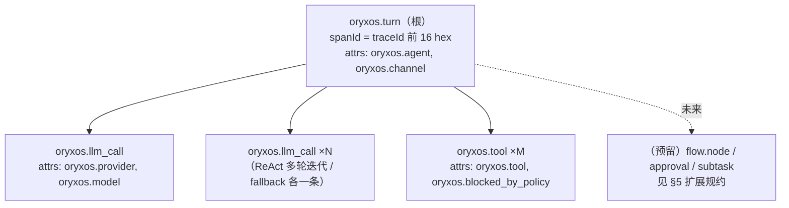

# 统一 Trace/Span 关联数据模型（#470）

一次消息处理 = 一个 traceId，贯穿库内审计、日志、OTel trace 与 metrics 四个观测面——**同源不同面**：审计供精确回放（021），OTel 供跨系统链路（039/#486），metrics 供聚合告警（023/#487），日志供现场排查（MDC）。本文是四面共用的数据模型契约。

## 1. traceId：唯一关联键

- **产生**：`TraceContext.openIfAbsent()`——单轮入口（`AgentService.process` / `processStateless`）兜底生成 UUID；REST 入口先开则复用同一 ID 并在响应体回传（`MessageResponse.traceId`）。
- **跨线程**：唯一显式传递点在 `AgentExecutionService.triggerAsync`——主线程生成 → 后台虚拟线程 `TraceContext.open(traceId)` 置入（021 R4）；除此之外全部 ThreadLocal 隐式携带。
- **落点**：

| 观测面 | 载体 | 形态 |
|--------|------|------|
| 审计 | `llm_calls.trace_id` / `tool_invocations.trace_id` / `agent_executions.trace_id` | UUID 原文（36 字符含横线） |
| 日志 | Logback MDC `traceId`（dev `%X{traceId}` / prod JSON 字段） | UUID 原文 |
| SSE | 流首 `trace` 事件与 `done` 事件 | UUID 原文 |
| OTel trace | Span 的 TraceId | **UUID 去横线 = 32 hex**（`OtelSpanRecorder.normalize`，同源映射非第二套 ID） |
| OTel metrics | 无 traceId（聚合面）；经 `service.name=oryxos` 资源标识与 trace 同后端关联 | — |

**向后兼容承诺**：审计/日志/API 面的 trace_id 形态永不改变；OTel 侧只做单向映射。

## 2. Span 树模型

- **确定性父子**：根 span 的 SpanId 固定取 traceId 前 16 hex——三个记录点（AgentService / SpringAiProviderServiceImpl / ToolExecutor）互不传句柄，**事后补记、乱序到达**也能拼出正确树。这是本模型的核心机制：不引入任何上下文传播新设施。
- **事后补记式**：span 携带显式起止时间，取自各点位**既有**的 startedAt/durationMs 计时区间——与审计表耗时严格同源（同一次测量）。
- **失败语义**：success=false 置 `StatusCode.ERROR`；工具被 020 策略拦截记 `oryxos.blocked_by_policy=true`（同样计一条 tool span，与审计 `blocked_by='policy'` 对应）。
- **未开轮不记**：租约等待超时等未进入执行段的失败没有 turn span——没有开轮就没有轮。

## 3. 三类 span 与审计表的行级对应

| Span | 审计行 | 对应关系 |
|------|--------|---------|
| `oryxos.turn` | `agent_executions`（异步触发时） | 1:1，同 traceId；同步对话轮无 execution 行，turn span 仍在 |
| `oryxos.llm_call` | `llm_calls` 一行 | 1:1——含 fallback：每次尝试各一条审计行、各一个 span |
| `oryxos.tool` | `tool_invocations` 一行 | 1:1——含策略拦截行 |

库内还原走 `GET /api/v1/audit/trace/{traceId}`（扁平 seq 时间线）；树形还原走 OTel 后端。两边行数必然一致，可互为校验。

## 4. 纪律（实现方义务）

- 契约 `SpanRecorder`（core）全 default + NOOP：不配 `oryxos.otel.endpoint` 零开销零依赖；实现异常自吞，绝不影响主链路（与 `MetricsRecorder` 同纪律）
- 属性只放**低基数维度**（agent/channel/provider/model/tool 名），绝不放 prompt、参数、结果内容（防敏感泄漏，与日志纪律一致）
- 非法/空 traceId 的 span 静默丢弃；导出走 BatchSpanProcessor 异步批量，端点不可达缓冲丢弃

## 5. 扩展规约（未来实体的挂接方式，随 epic 落地时启用）

新实体接入本模型只需遵守三条，即可自动融入既有 trace 树：

1. **同 traceId**：从 `TraceContext.current()` 取，绝不自造
2. **父 span 引用**：一轮内的新 span 以 `traceId 前 16 hex` 为 parentSpanId（turn 下挂）；**跨轮长活实体**（Flow 执行、审批等待）自身升为该实体 trace 的根，用 span link 关联触发它的 turn trace
3. **命名 `oryxos.<entity>`** + 低基数属性，SpanRecorder 增加对应 default 方法（NOOP 纪律不变）

| 预留实体 | 依赖 | 建议命名 |
|---------|------|---------|
| Flow 节点 | #456（#467/#468） | `oryxos.flow_node`（attrs: flow, node, node_type） |
| 审批 | #455（#464/#466） | `oryxos.approval`（attrs: policy, decision） |
| 子任务/子 Agent | Flow 之后的委托机制 | `oryxos.subtask` |

## 6. 已知留白（如实记录）

- **fallback 重试的显式建模**：同 turn 下主备 llm span 按时序隐式可见（失败→成功相邻），`oryxos_fallback_switches_total` 指标佐证，但 span 间无显式 `retry_of` link/属性——需要把切换链路传进记录点，留待有跨系统排障实需时补
- **用户重发**：全新 trace、不关联失败轮——026 「不重放」裁决的刻意设计，非缺口
