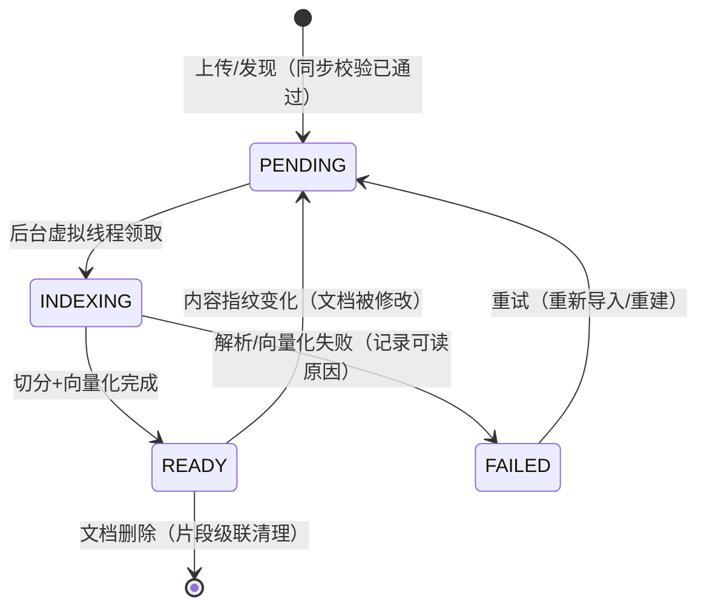

# Data Model: 知识库（Knowledge Base）

**Date**: 2026-08-19　**Feature**: [spec.md](spec.md)　**Plan**: [plan.md](plan.md)

两类事实源：**文件系统**承载实体与关系（知识库目录、清单、绑定软连接——GitOps 可管），
**SQLite** 承载索引产物与状态（文档索引状态、片段与向量——可重建的派生数据）。删除
知识库目录后对账即可清掉库内派生数据；反之数据库损坏可从目录全量重建。

## 1. 文件系统实体

### 知识库（KnowledgeBase）＝ 一个目录

```text
.oryxos/knowledge/<库名>/
├── KNOWLEDGE.md          # 清单（必须）：frontmatter 元数据；正文可写库级说明（不入索引）
├── disk-alert.md         # 文档（清单之外的受支持文件即文档）
├── faq.txt
└── manuals/              # 允许子目录；出处用库内相对路径
    └── ops-handbook.pdf
```

`KNOWLEDGE.md` frontmatter：

```yaml
---
name: ops-manual            # 必须与目录名一致，否则视为非法库（不注册 + 告警）
description: 运维手册与告警处置知识   # 注入 Agent 上下文的描述（渐进披露元数据）
backend: local              # 缺省 local；远程后端写注册名（如 ragflow）
# 远程后端追加连接引用，凭证走环境变量占位，不落明文：
# backend: ragflow
# connection:
#   base_url: https://ragflow.internal.example
#   dataset_id: ds-123
#   api_key: ${RAGFLOW_API_KEY}
---
```

约束（FR-001/FR-015、Edge Cases）：
- 库名唯一（目录名即主键）；重名创建拒绝。
- 远程后端库目录内只有清单与连接引用，无文档文件。
- 空文档跳过；单文档 > 10MB 拒绝；二进制/不支持类型忽略并告警；扫描件 PDF
  （文本层为空）导入时拒绝。

### Agent 知识绑定（AgentKnowledgeBinding）＝ 相对软连接

```text
.oryxos/agents/<Agent名>/knowledge/<库名> → ../../../knowledge/<库名>
```

- 软连接集合是绑定的**唯一事实来源**；`AGENT.md` frontmatter 不声明知识库（FR-002）。
- 合法性校验（真实路径）：必须相对链接、真实目标位于 `.oryxos/knowledge/` 根内、
  链接名 = 目标目录名 = 清单 name。非法态枚举：`dangling` / `escaped` /
  `invalid-target` / `name-mismatch`（与 Skill 绑定同一分类）。
- 多对多：一个 Agent 绑多库，一库被多 Agent 绑；删除被引用库默认拒绝（FR-011）。

## 2. SQLite 表（schema.sql 手工 DDL，追加两表）

```sql
-- 知识文档：库内源文件的索引状态（派生自文件系统，可重建）
CREATE TABLE IF NOT EXISTS knowledge_documents (
    id              INTEGER PRIMARY KEY AUTOINCREMENT,
    kb_name         VARCHAR(128) NOT NULL,             -- 所属知识库（目录名）
    rel_path        VARCHAR(512) NOT NULL,             -- 库内相对路径（出处组成部分）
    content_sha256  VARCHAR(64)  NOT NULL,             -- 内容指纹（变更检测）
    status          VARCHAR(16)  NOT NULL,             -- PENDING/INDEXING/READY/FAILED
    failure_reason  TEXT,                              -- FAILED 时可读原因
    chunk_count     INTEGER      NOT NULL DEFAULT 0,
    generation      INTEGER      NOT NULL DEFAULT 0,   -- 双缓冲代号（FR-024）
    indexed_at      TIMESTAMP,
    created_at      TIMESTAMP    NOT NULL,
    updated_at      TIMESTAMP    NOT NULL,
    UNIQUE (kb_name, rel_path, generation)
);
CREATE INDEX IF NOT EXISTS idx_kdoc_kb ON knowledge_documents (kb_name, generation);

-- 知识片段：检索最小单元，含向量与出处信息
CREATE TABLE IF NOT EXISTS knowledge_chunks (
    id              INTEGER PRIMARY KEY AUTOINCREMENT,
    document_id     INTEGER      NOT NULL,             -- → knowledge_documents.id
    kb_name         VARCHAR(128) NOT NULL,             -- 冗余，检索按库全量加载
    seq             INTEGER      NOT NULL,             -- 片段序号（md/txt 出处位置）
    page_no         INTEGER,                           -- PDF 页码（PDF 出处位置）
    content         TEXT         NOT NULL,             -- 片段文本（关键词路检索对象）
    embedding       BLOB,                              -- float32[] 向量；降级期可空
    dim             INTEGER,                           -- 向量维度（FR-014 一致性校验）
    embedding_model VARCHAR(128),                      -- 向量化模型标识（FR-014）
    generation      INTEGER      NOT NULL DEFAULT 0,   -- 双缓冲代号
    created_at      TIMESTAMP    NOT NULL
);
CREATE INDEX IF NOT EXISTS idx_kchunk_kb  ON knowledge_chunks (kb_name, generation);
CREATE INDEX IF NOT EXISTS idx_kchunk_doc ON knowledge_chunks (document_id);
```

说明：
- **不建 knowledge_bases 表**：库清单以文件系统为准（宪法 VIII 单一事实源）；
  列表页信息 = 目录扫描（名称/描述/后端）+ 两表聚合（文档数/片段数/状态/时间）。
- **双缓冲**：重建时以 `generation + 1` 写新代，旧代持续服务；切换 = 库级活跃代号
  原子更新（内存持有 + 落库），随后删旧代行。活跃代号记录在
  `knowledge_documents` 聚合可推导，实现上由 `LocalKnowledgeBackend` 内存态 +
  启动对账恢复。
- **审计不新增表**：检索埋点（FR-022）结构化落既有 `tool_invocations.result_json`；
  embedding 调用落既有 `llm_calls`。看板只做聚合查询（FR-023）。

## 3. 状态机：文档索引状态（Clarify-Q3）



同步校验失败（不支持类型/扫描件/超 10MB）不进状态机——上传请求当场 4xx 拒绝，
不产生半完成记录（Edge Cases「入口即拒绝」）。

## 4. 值对象（oryxos-core/knowledge/model，跨模块契约）

| 值对象 | 字段 | 说明 |
|---|---|---|
| `KnowledgeQuery` | query（必填）、topK（默认 5）、kbNames（检索范围，由门面按绑定圈定） | 检索入参最小公约数（D9：topK + 阈值） |
| `KnowledgeHit` | citation（一等公民）、content、score、degraded（降级标记）、payload（Map，平台特有字段逃生舱） | 出处非空是硬契约 |
| `Citation` | kbName、relPath、position（片段序号或 `page:N`）、readable（本地可跟读 / 远程标注不可跟读） | `[库名] 路径 #位置` 渲染来源 |
| `KnowledgeBaseInfo` | name、description、backend、documentCount、chunkCount、indexStatus、lastIndexedAt | 列表/CLI/管理台共用投影 |
| `DocumentStatus` | relPath、status、chunkCount、failureReason、indexedAt | 详情页文档清单行 |
| `KnowledgeCapabilities` | retrieve（恒 true）、createDelete、importDocs、rebuild、status、rerank | 能力声明位（FR-006；rerank 位对应精排槽位） |
