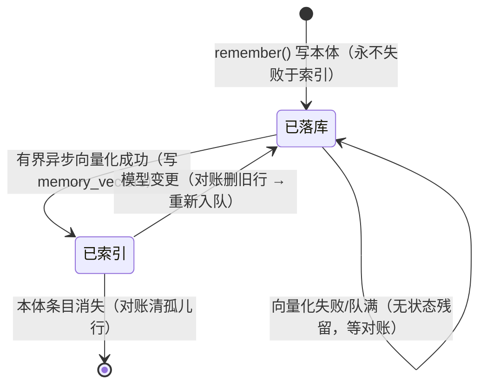

# Data Model: 记忆检索升级与后端契约对齐

**Date**: 2026-08-20　**Feature**: [spec.md](spec.md)　**Plan**: [plan.md](plan.md)

原则与 014 一致：**记忆本体是事实源**（markdown 文件 / memory_entries 表 / mem0 服务），
**向量索引是派生数据**（同库存储、可全量重建、删了不伤本体）。

## 1. 条目标识（跨档统一的对齐键）

```
entry_hash = sha256( agentName + "|" + scope + "|" + 条目行原文 )
```

- 不改任何本体存储格式即获得可寻址性（markdown 行没有 id，靠内容哈希）；
- 三路召回的候选经 entry_hash 对齐后进加权 RRF；
- 同内容重复写入 → 同哈希 → 索引一行（检索语义不受影响，返回的是条目原文）；
- 时间来源：markdown 档解析行首 `- [yyyy-MM-dd HH:mm]` 时间戳；sqlite 档用 `created_at`。

## 2. SQLite 变更（schema.sql 手工 DDL + 幂等升级器）

```sql
-- memory_vectors：归档记忆条目的向量索引（015）——派生数据，可从记忆本体全量重建。
-- entry_hash = sha256(agent|scope|条目原文)，跨后端档统一寻址；embedding 为 float32[] 小端序 BLOB
--（复用 014 编解码）。DELEGATED 档（mem0）不产生行。
CREATE TABLE IF NOT EXISTS memory_vectors (
    id INTEGER PRIMARY KEY AUTOINCREMENT,
    entry_hash VARCHAR(64) NOT NULL,
    agent_name VARCHAR(128) NOT NULL,
    content TEXT NOT NULL,               -- 条目原文副本（语义路直接出结果，免回读本体）
    embedding BLOB NOT NULL,
    dim INTEGER NOT NULL,
    embedding_model VARCHAR(128) NOT NULL,
    entry_time TIMESTAMP,                -- 条目时间（时间新近路依据；解析不出为 NULL，按最旧处理）
    created_at TIMESTAMP NOT NULL,
    UNIQUE (agent_name, entry_hash)
);
CREATE INDEX IF NOT EXISTS idx_memvec_agent ON memory_vectors (agent_name);
```

`memory_entries` 补列（新装库由 schema.sql 全量建；存量库由 `MemorySchemaUpgrade`
PRAGMA 检测 + ALTER 幂等补齐，照 ScheduleSchemaUpgrade 先例）：

```sql
-- 015：agent_name 修复 sqlite 档作用域缺口（记忆跟 Agent 走）；存量行归 '__global__' 占位
ALTER TABLE memory_entries ADD COLUMN agent_name VARCHAR(128) NOT NULL DEFAULT '__global__';
CREATE INDEX IF NOT EXISTS idx_memory_agent ON memory_entries (agent_name, scope);
```

说明：`__global__` 占位与 markdown 档「无 Agent 上下文回退全局文件」语义对齐；升级器首启打一次
可读迁移说明日志。索引状态不单设列——「已索引」= memory_vectors 有对应行且 model 一致，
「待索引」= 无行（对账即补），天然幂等。

**仅归档条目产生索引行**（FR-005）：core 条目不向量化、不入表——表因此无需 scope 列
（表内只可能是 ARCHIVAL）；写入侧按 scope 过滤入队，对账取数走 `archivalEntries()` 天然只含归档区，
双保险杜绝 core 记忆经语义路被检回（核心区不参与检索，契约四）。

## 3. 契约形状（详见 contracts/memory-backend.md）

| 类型 | 位置 | 要点 |
|---|---|---|
| `MemoryRecallCapability` | core/memory | 枚举 KEYWORD / HYBRID_BUILTIN / DELEGATED |
| `MemoryEntryView(content, time)` | core/memory | archivalEntries() 的行形状（时间路 + 对账取数） |
| `LongTermMemoryStore`（升级） | oryxos-memory | +capabilities() +archivalEntries()；scope 参数即分区必选语义 |

## 4. 配置键

| 键 | 缺省 | 说明 |
|---|---|---|
| `embedding.provider` / `embedding.model` | 空（= 纯关键词+时间模式） | 全局向量化配置；空时回读 `knowledge.embedding.*` 兼容别名 |
| `memory.recall.weight.semantic/keyword/recency` | 1.0 / 1.0 / 1.0 | 加权 RRF 系数（Clarify-R3） |
| `memory.recall.top-k` | 20 | 融合后返回上限；未配置向量化时不生效（保字节级兼容） |
| `memory.mem0.base-url` / `user-id`（既有）+ `api-key` | — | api-key 走 `${ENV}` 引用 |

## 5. 状态与流转



关键不变量：任何时刻「关键词路 + 时间路」都覆盖全部本体条目——索引落后只影响语义路的覆盖面，
不产生召回黑洞（Edge Case「追齐窗口零召回损失」的结构性保证）。
