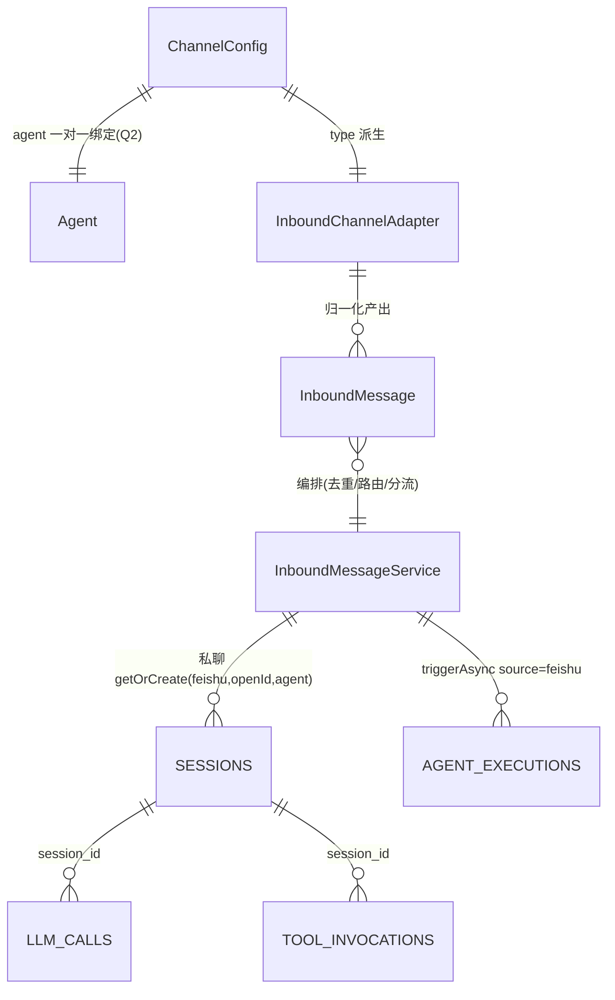

# Data Model: IM 入站渠道抽象与飞书双向接入（017）

**Date**: 2026-08-25 | **Plan**: [plan.md](./plan.md)

原则：**零 SQLite schema 变更**。新实体全部是内存值对象 + 一份 YAML 配置文件；持久化完全复用既有四表（sessions / llm_calls / tool_invocations / agent_executions）。

## 1. InboundMessage（归一化入站消息，record，`oryxos-core`）

平台事件经适配器归一化后的唯一入站模型；编排服务只认它，不认平台原始事件。

| 字段 | 类型 | 说明 | 校验 |
|------|------|------|------|
| `channelType` | String | 渠道类型，本期恒 `"feishu"` | 非空 |
| `channelName` | String | channels.yaml 里的渠道名（一应用一条目） | 非空 |
| `messageId` | String | 平台全局消息标识，**去重键**（飞书官方：用 message_id 不用 event_id） | 非空 |
| `chatKind` | ChatKind | `P2P` / `GROUP` | 非空 |
| `userId` | String | 提问者标识（飞书 open_id）；私聊会话三元组的 user 位 | 非空 |
| `chatId` | String | 回复目标（私聊=用户会话，群聊=群） | 非空 |
| `content` | String | 纯文本正文；群聊已剥离 @ 机器人片段、其余 mention 已替换为人名 | 可空串（非文本时） |
| `textual` | boolean | 是否文本消息；false 触发能力说明回复（FR-009） | — |
| `mentionedBot` | boolean | 群聊是否 @ 了本机器人；**false 的群消息不得进入编排**（适配器层丢弃，SC-002） | GROUP 时有意义 |

**不变式**：`chatKind==GROUP` 的消息进入编排服务时必然 `mentionedBot==true`——非 @ 群消息在归一化层丢弃，不产生任何对象与记录。

## 2. ChatKind（枚举，`oryxos-core`）

`P2P`（私聊，建持久会话）| `GROUP`（群聊，无状态独立问答）。

## 3. ChannelConfig / ChannelBinding（配置模型，`oryxos-core`）

`.oryxos/channels.yaml` 一个条目 = 一个飞书应用 = 一个绑定（Clarify-Q2 一对一）。

```yaml
# .oryxos/channels.yaml（权限 rw-------；${ENV} 占位落盘保留字面量）
channels:
  - name: ops-feishu            # 渠道名，唯一键
    type: feishu                # 适配器类型（本期仅 feishu）
    app_id: ${FEISHU_APP_ID}
    app_secret: ${FEISHU_APP_SECRET}
    agent: ops-agent            # 绑定的 Agent（AGENT.md 目录名）
    enabled: true               # 停用即断连不删配置
```

| 字段 | 校验（加载与 Admin 变更时，点名报错） |
|------|------|
| `name` | 非空、唯一、`[a-zA-Z0-9_-]+` |
| `type` | 必须是已注册的适配器类型，否则报「不支持的渠道类型」 |
| `app_id` / `app_secret` | resolved 后非空且不含 `${`（环境变量未解析 = 点名报「渠道 X 的 app_secret 未配置或环境变量未解析」），该渠道不上线，不影响其余渠道与功能（FR-013/SC-008） |
| `agent` | `profileRegistry.get(agent)` 非空，否则报「渠道 X 绑定的 Agent Y 不存在」，不带病上线 |
| `enabled` | 缺省 true |

**双读法**（复刻 McpConfigLoader）：`loadRaw()` 保留 `${}` 字面量，供 REST CRUD 与回写；`load()` 解析环境变量，仅供建连接。

## 4. ChannelStatus（运行状态，record，`oryxos-core`）

| 字段 | 类型 | 说明 |
|------|------|------|
| `name` / `type` | String | 标识 |
| `agent` | String | 绑定 Agent |
| `state` | enum `CONNECTED` / `DISCONNECTED` / `DISABLED` / `ERROR` | 长连接实况 |
| `error` | String? | ERROR 时的点名原因（凭证未解析/Agent 不存在/连接失败） |

暴露于 `GET /api/v1/channels/status` 与日志；注册表返回活视图（#203 教训，不 copyOf 拍照）。

## 5. MessageDeduplicator（去重缓存，内存，`oryxos-core`）

- 键：`channelName + ":" + messageId`；值：进入时间。
- 结构：`LinkedHashMap` LRU，容量 5000，TTL 12h，`synchronized`。
- 语义：`markIfFirst(key)` 原子判重；重复 → 静默丢弃（用户仅收到 1 条回答，SC-004）。
- 生命周期：进程内、可丢失（重启窗口由 spec Edge Case 豁免）；非业务状态，不违背「状态外置」。

## 6. 会话与审计标识（复用既有表，零 DDL）

| 场景 | session_id | 落表 |
|------|-----------|------|
| 私聊 | `feishu:<open_id>:<agent>`（`SessionManager.getOrCreate("feishu", openId, agent)` 唯一拼接点生成） | `sessions`（channel=`feishu`）+ `llm_calls`/`tool_invocations` 随会话 |
| 群聊 | `feishu-group:<UUID>`（`processStateless` 新重载 executionTag=`"feishu-group"`） | 不落 `sessions`；`llm_calls`/`tool_invocations` 照落 |
| 执行历史 | 同上 | `agent_executions`：`source="feishu"`（triggerAsync） |

渠道维度查询口径：`sessions.channel='feishu'`、`session_id LIKE 'feishu%'`、`agent_executions.source='feishu'`（SC-006 与 CLI/REST 同构）。

## 7. 状态转换（渠道生命周期）

```
(配置加载/Admin add)──校验失败──▶ ERROR(点名原因，不上线，不影响他人)
        │校验通过
        ▼
   CONNECTING ──▶ CONNECTED ◀──(SDK 自动重连)── DISCONNECTED
        │                                         ▲
   (enabled:false / Admin remove/update)──────────┘
        ▼
    DISABLED / 移除（先 disconnect 再落盘再重连，复刻 MCP admin 顺序）
```

## 8. 关系图


